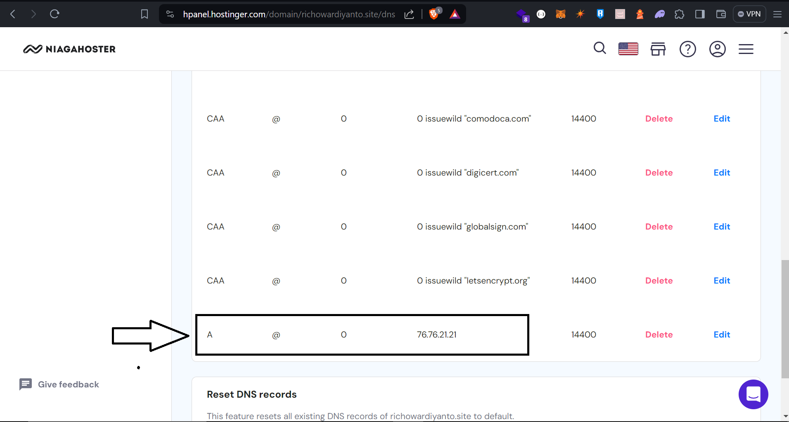

# PRX

## Introduction

Welcome to the company profile for PRX, PRX Solutions is a leading cryptocurrency firm dedicated to revolutionizing the digital financial landscape through innovative blockchain solutions.

## Usage

```bash
git clone https://github.com/RevoU-FSSE-4/milestone-1-richo_wardiyanto
```

```bash
cd milestone-1-richo_wardiyanto
```

## Deploy

### Create Vercel site from GitHub repository

- Click "Continue Github"
    
- Select folder for add domain
    
- Write domain  name (e.g., `richowardiyanto.site`)
    
- Add DNS on Niagahoster
    
- Match the same DNS on Vercel
    
- Congratulation :), your website  is deployed now.
    